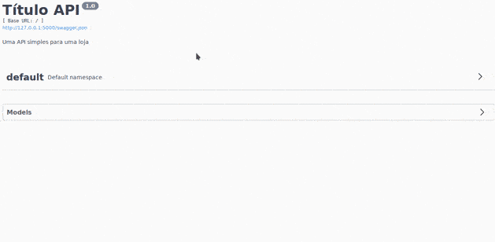

# Iniciando com Flask-RESTX Framework

Flask-RESTX é uma extensão para Flask que adiciona suporte para construir APIs REST rapidamente. Flask-RESTX incentiva as melhores práticas com configuração mínima. Se você está familiarizado com o Flask, o Flask-RESTX deve ser fácil de aprender. Ele fornece uma coleção coerente de decoradores e ferramentas para descrever sua API e expor sua documentação corretamente (usando Swagger).[<sup>1</sup>](#1)

## Primeiros passos

O ideal é criar um ambiente de desenvolvimento virtual para rodar o projeto. Geralmente, recomendam o uso do `virtualenv`. Caso queira fazer deploy de uma aplicação Flask no Heroku é melhor usar uma versão `3.6 >= 3.6.x <= 3.6.13` do Python, que pode ser facilmente instalado pelo `miniconda/anaconda`.

Nesse [link](https://github.com/cauachagas/cling-torch#passo-1---instalando-miniconda) mostro como instalar o miniconda e criar um ambiente de desenvolvimento.

## Como rodar o projeto

1. Clone o repositório;
2. Crie um ambiente de desenvolvimento;
3. Ative o ambiente do passo anterior;
4. Instale as dependências;
5. Inicie o servidor.

Caso use o `miniconda/anaconda` e tenha os scripts `conda` e `activate` no `$PATH` então o passos serão esses

```bash
git clone https://github.com/cauachagas/flask-restx-api-exemplo
cd flask-restx-api-exemplo
conda env create -f environment.yml
source activate flask-restx
python main.py
```

Em seguida abra o link http://127.0.0.1:5000/ no seu navegador.

## Exemplo



## Referências
- <a class="anchor" id="1">https://flask-restx.readthedocs.io/en/latest/</a>
- https://www.youtube.com/watch?v=levz4eumJ98
